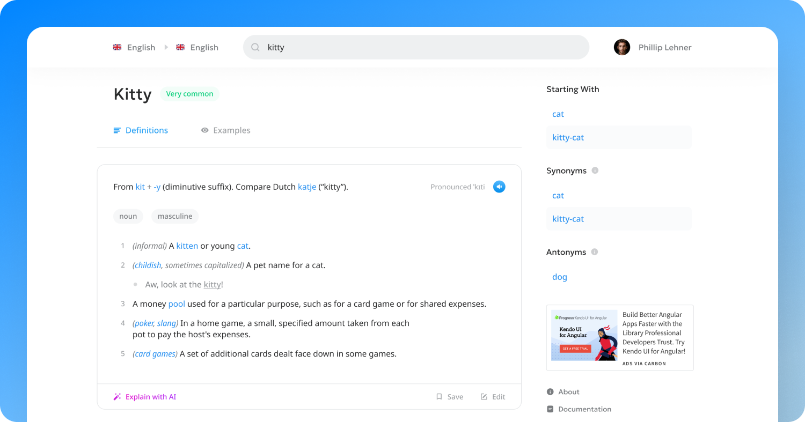

# The Open Dictionary

The Open Dictionary is the world's most advanced online dictionary, designed for educators, linguists, and language learners alike. It's like Wiktionary, except fully backed by structured data and supported via the [ODict file format](https://github.com/TheOpenDictionary/odict).

It looks something like this ⬇️

The Open Dictionary isn't live quite yet – but will eventually live at https://odict.org. 

⚠️ This project is under active development, so star and watch the repo if you're interested in following along!